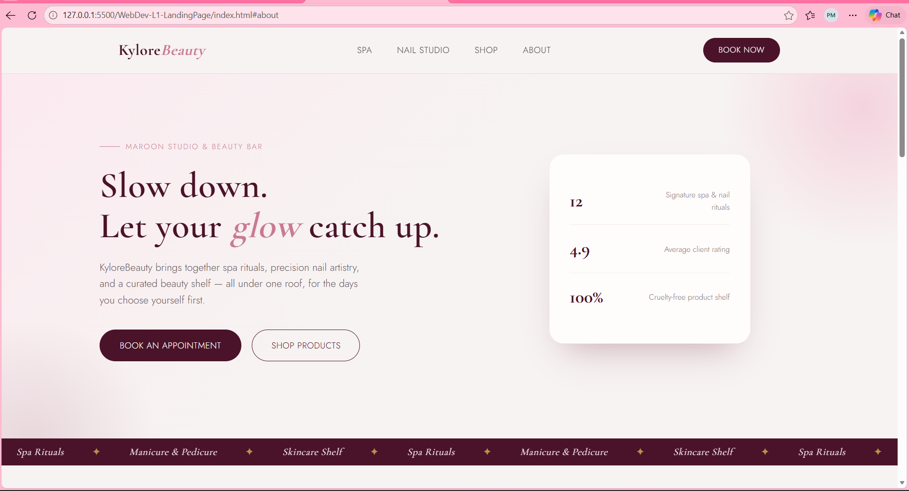
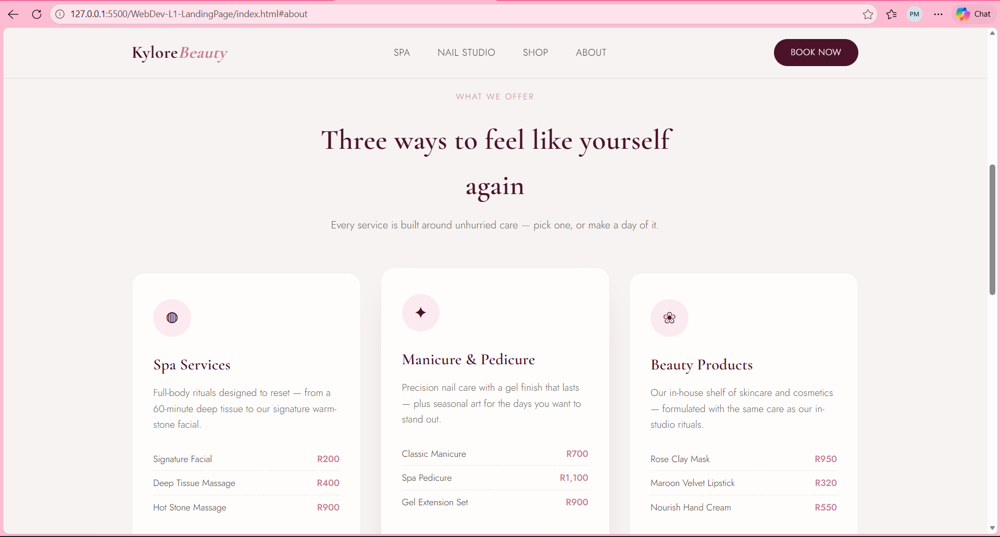
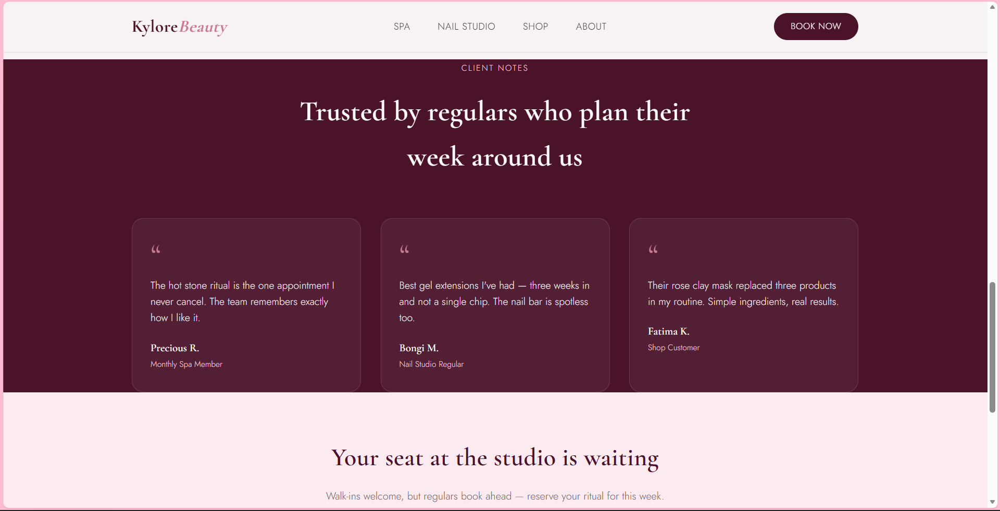
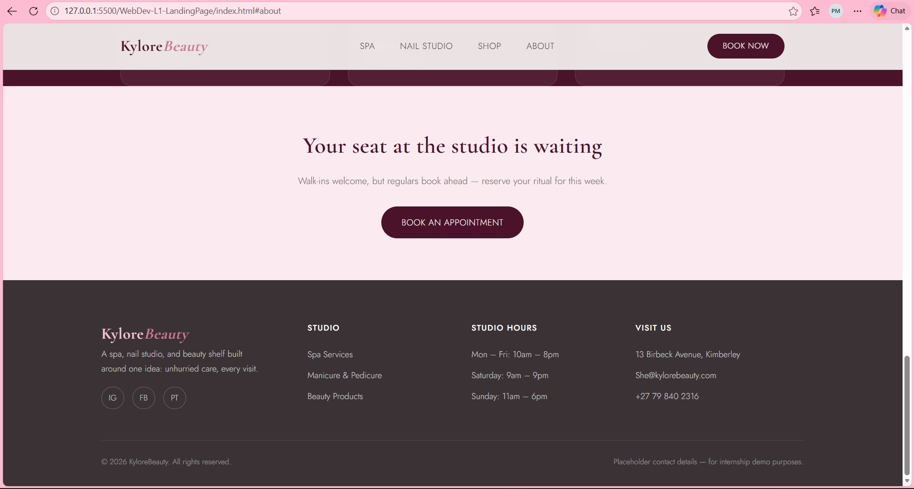

# OIBSIP
# Web Development Internship — Level 1, Task 1: Landing Page

**Intern:** Puleng Mahapa
**Track:** Web Development & Designing
**Organization:** Oasis Infobyte (OIBSIP)

## 🌸 Project: KyloreBeauty — Landing Page

A responsive landing page for **KyloreBeauty**, a fictional beauty brand offering spa services, manicure & pedicure, and beauty products. Built as part of the Web Development Level 1 internship task.

## ✨ Features

- Sticky navigation bar with smooth-scroll links (Spa, Nail Studio, Shop, About)
- Hero section with headline, subheadline, and two call-to-action buttons
- Three service cards: Spa Services, Manicure & Pedicure, Beauty Products
- Client testimonials section
- Newsletter/booking call-to-action strip
- Fully responsive footer with contact details, hours, and social links
- Fully responsive layout (desktop, tablet, mobile) using CSS Grid & Flexbox
- Custom color palette (maroon, grey, pink) and paired typography (Cormorant Garamond + Jost)

## 🛠️ Tech Stack

- HTML5
- CSS3 (Grid, Flexbox, custom properties, media queries)
- No JavaScript required for this task

## 📁 Folder Structure

```
WebDev-L1-LandingPage/
├── index.html
├── README.md
└── screenshots/
    ├── desktop-view.png
    └── mobile-view.png
```

## ▶️ How to Run

1. Clone this repository:
   ```bash
   git clone https://github.com/yourusername/OIBSIP.git
   ```
2. Navigate to this task's folder:
   ```bash
   cd OIBSIP/WebDev-L1-LandingPage
   ```
3. Open `index.html` directly in any browser, or use the VS Code **Live Server** extension for auto-refresh during development.

## 📸 Screenshots
DESKTOP SCREENSHOT




## 🔗 Links

- Demo video: [LinkedIn post link here]
- Live preview (if hosted): [GitHub Pages link here]

## 🙏 Acknowledgements

Built as part of the **Oasis Infobyte Summer Internship Program (OIBSIP)** — Web Development & Designing track, Level 1.

#oasisinfobyte