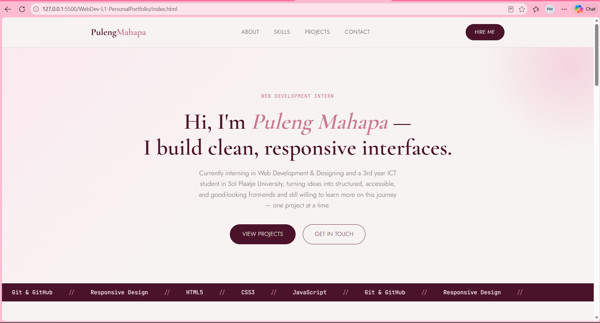
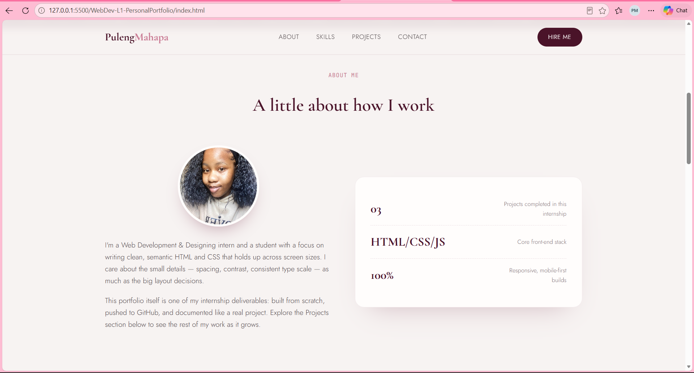
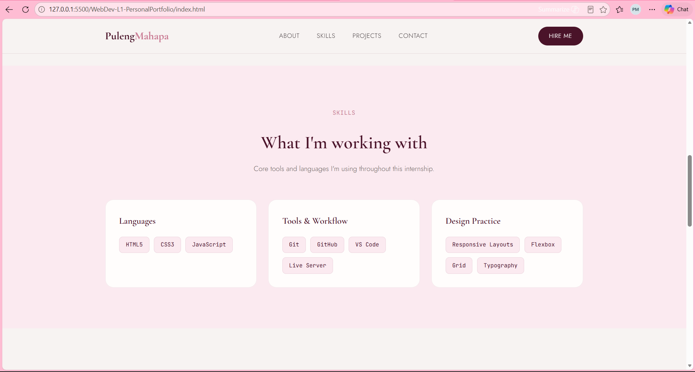
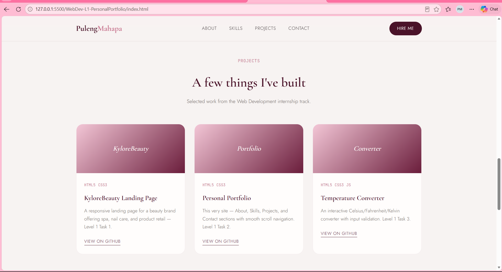
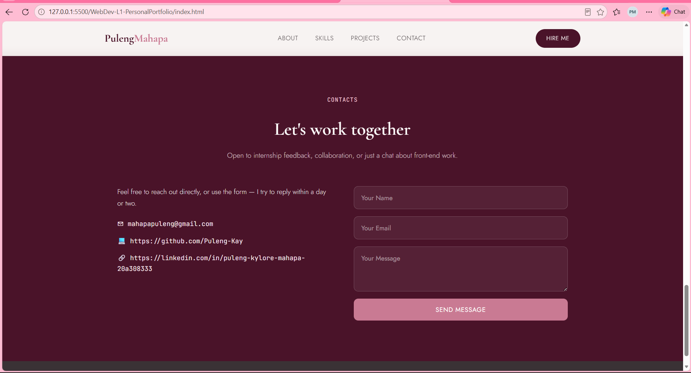

# Web Development Internship — Level 1, Task 2: Personal Portfolio

**Intern:** Puleng Mahapa
**Track:** Web Development & Designing
**Organization:** Oasis Infobyte (OIBSIP)

## 👤 Project: Personal Portfolio Website

A responsive personal portfolio website showcasing my profile, skills, and projects as a Web Development intern. Built as part of the Web Development Level 1 internship task.

## ✨ Features

- Sticky navigation bar with smooth-scroll links (About, Skills, Projects, Contact)
- Hero section introducing name and role, with call-to-action buttons
- Scrolling skills marquee bar
- About section with profile photo and quick-facts card
- Skills section grouped into Languages, Tools & Workflow, and Design Practice
- Projects section featuring 3 project cards with tags and links
- Contact section with contact details and a message form (UI only, no backend)
- Fully responsive layout (desktop, tablet, mobile) using CSS Grid & Flexbox
- Consistent color palette (maroon, grey, pink) and paired typography (Cormorant Garamond, Jost, JetBrains Mono)

## 🛠️ Tech Stack

- HTML5
- CSS3 (Grid, Flexbox, custom properties, media queries)
- JavaScript not required for this build (smooth scroll handled via CSS)

## 📁 Folder Structure

```
WebDev-L1-PersonalPortfolio/
├── index.html
├── profile.jpg
├── README.md
└── screenshots/
    ├── desktop-view.png
    └── mobile-view.png
```

## ▶️ How to Run

1. Clone this repository:
   ```bash
   git clone https://github.com/yourusername/OIBSIP.git
   ```
2. Navigate to this task's folder:
   ```bash
   cd OIBSIP/WebDev-L1-PersonalPortfolio
   ```
3. Open `index.html` directly in any browser, or use the VS Code **Live Server** extension for auto-refresh during development.

## 📸 Screenshots







## 🔗 Links

- Demo video: [LinkedIn post link here]
- Live preview (if hosted): [GitHub Pages link here]

## 🙏 Acknowledgements

Built as part of the **Oasis Infobyte Summer Internship Program (OIBSIP)** — Web Development & Designing track, Level 1.

#oasisinfobyte