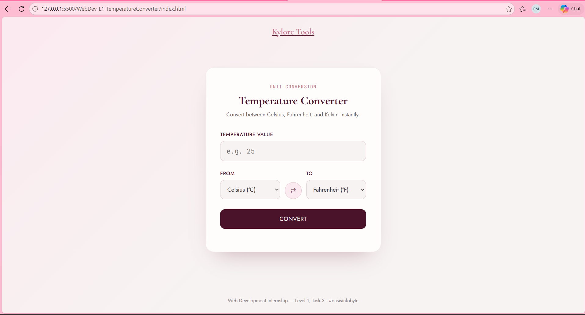

# Web Development Internship — Level 1, Task 3: Temperature Converter

**Intern:** Puleng Mahapa
**Track:** Web Development & Designing
**Organization:** Oasis Infobyte (OIBSIP)

## 🌡️ Project: Temperature Converter

An interactive temperature converter that switches between Celsius, Fahrenheit, and Kelvin, with input validation and a physically-accurate absolute-zero check. Built as part of the Web Development Level 1 internship task.

## ✨ Features

- Convert between Celsius, Fahrenheit, and Kelvin
- Unit selectors for both "From" and "To" units, plus a one-click swap button
- Convert button (also works by pressing Enter)
- Input validation:
  - Rejects empty input
  - Rejects non-numeric input (letters, symbols, malformed numbers)
- Absolute-zero edge case: rejects any value below -273.15°C / -459.67°F / 0K with a clear error message, since no real temperature can go below it
- Displays the equivalent value in the other two units alongside the main result
- Fully responsive layout for mobile and desktop

## 🛠️ Tech Stack

- HTML5
- CSS3 (Flexbox, Grid, media queries)
- Vanilla JavaScript (DOM manipulation, input validation, event handling)

## 📁 Folder Structure

```
WebDev-L1-TemperatureConverter/
├── index.html
├── README.md
└── screenshots/
    ├── desktop-view.png
    └── mobile-view.png
```

## ▶️ How to Run

1. Clone this repository:
   ```bash
   git clone https://github.com/yourusername/OIBSIP.git
   ```
2. Navigate to this task's folder:
   ```bash
   cd OIBSIP/WebDev-L1-TemperatureConverter
   ```
3. Open `index.html` directly in any browser, or use the VS Code **Live Server** extension for auto-refresh during development.

## 🧪 Try These Test Cases

- `25` °C → °F should give `77°F`
- Leave the field empty and click Convert → shows a validation error
- Enter `abc` → shows a "valid number" error
- Enter `-300` with Celsius selected → shows the absolute-zero error

## 📸 Screenshots



## 🔗 Links

- Demo video: [LinkedIn post link here]
- Live preview (if hosted): [GitHub Pages link here]

## 🙏 Acknowledgements

Built as part of the **Oasis Infobyte Summer Internship Program (OIBSIP)** — Web Development & Designing track, Level 1.

#oasisinfobyte